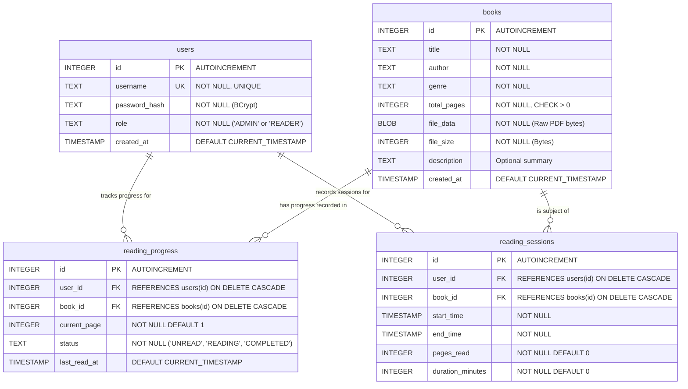
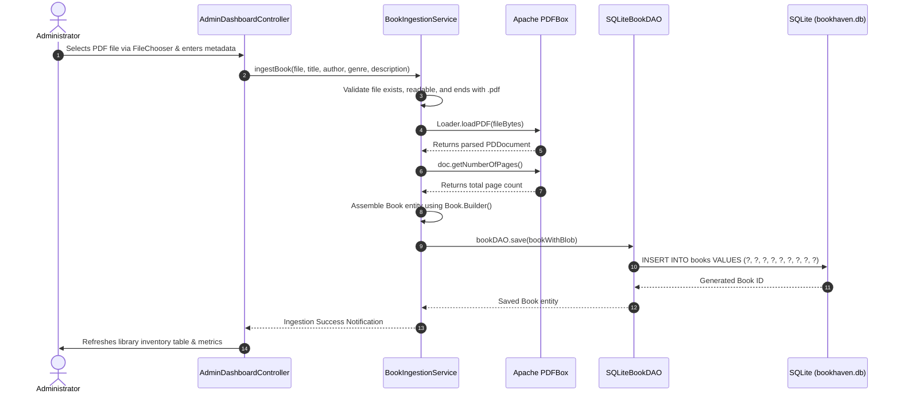
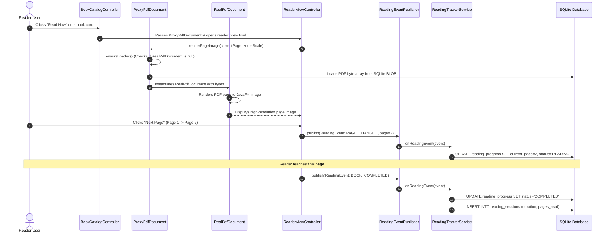
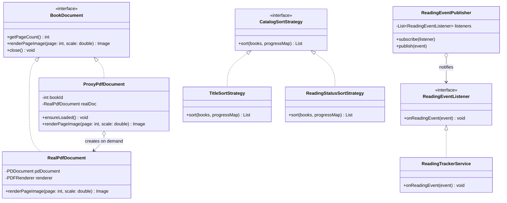

# 📘 BookHaven — Technical Documentation
### Design Patterns (Theory & Lab Course) — Final Project Report

---

## 📌 1. Project Information & Metadata

- **Project Title:** BookHaven — Desktop E-Reader & Library Management System
- **Repository URL:** [https://github.com/mdabu-rayhan/minispl](https://github.com/mdabu-rayhan/minispl)
- **Primary Domain:** Document Management, E-Reading, and Personal Reading Analytics
- **Target Platform:** Desktop (Windows / macOS / Linux)
- **Programming Language:** Java 21 LTS
- **GUI Framework:** JavaFX 21 (OpenJFX) with FXML and Modena CSS
- **PDF Engine:** Apache PDFBox 3.0.1
- **Persistence Engine:** SQLite 3 via SQLite-JDBC
- **Security:** jBCrypt 0.4 (Salted Password Hashing)
- **Build & Dependency Management:** Apache Maven 3.9+
- **Testing Framework:** JUnit 5 (Jupiter 5.10) — 25 Unit Tests (100% Pass)

### 👥 Team Members & Contribution Division

| Team Member | Academic Email | Project Role | Phases & Modules Owned |
| :--- | :--- | :--- | :--- |
| **Person 1 (Sajib Sarkar)** | `sajibsarkar551@gmail.com` | Backend, Persistence & Document Engine | **Phase 1:** Maven POM, .gitignore, SQLite Schema, DatabaseManager<br>**Phase 2:** Domain Entities & SQLite DAOs<br>**Phase 4:** Virtual Proxy Engine (`RealPdfDocument`, `ProxyPdfDocument`, `BookIngestionService`)<br>**Phase 7:** Creational Refactoring (`Book.Builder`, `UserFactory`, `DatabaseSeeder`) |
| **Person 2 (Md Abu Rayhan)** | `bsse1651@iit.du.ac.bd` | Security, JavaFX UI, Behavioral Patterns & Tests | **Phase 3:** BCrypt Security (`PasswordHasher`), `SessionContext`, `AuthService`<br>**Phase 5:** JavaFX FXML Views, CSS, UI Controllers (`Login`, `Catalog`, `Reader`, `Admin`)<br>**Phase 6:** Observer Reading Engine & Catalog Sort Strategy<br>**Phase 8:** Automated JUnit 5 Test Suite (25 Tests), README & Technical Documentation |

---

## 🎯 2. Domain, Problem Analysis & Scope

### 2.1 Problem Statement
Modern readers and academic students frequently handle large collections of technical books, research publications, and lecture slides in PDF format. Mainstream document readers either suffer from excessive bloat, aggressive cloud-tracking, or rigid interfaces that fail to maintain persistent reading state across sessions. Conversely, naive desktop reader implementations suffer from severe memory bottlenecks when attempting to parse and cache multi-megabyte PDF binary streams simultaneously.

### 2.2 Solution Overview
**BookHaven** is an offline, distraction-free desktop personal library and PDF e-reader. It solves two critical challenges:
1. **Memory Preservation via Lazy Loading:** By implementing the **Virtual Proxy Pattern**, heavy PDF byte streams are only pulled from the SQLite database into memory when a user explicitly opens a book for reading. Browsing the library catalog remains instantaneous regardless of library size.
2. **Decoupled Reading State Tracking:** By implementing the **Observer Pattern**, turning pages automatically records the user's progress, transitions reading state (from `UNREAD` to `READING` to `COMPLETED`), and logs session durations without embedding database queries into JavaFX UI event handlers.

### 2.3 Why BookHaven Goes Beyond Simple CRUD
BookHaven is deliberately engineered with non-trivial domain logic:
- **Binary PDF Ingestion & Validation Pipeline:** Ingests raw PDF files from the OS filesystem, validates binary headers, extracts structural metadata (page counts, titles) via Apache PDFBox, and stores binaries as SQLite BLOBs.
- **On-Demand Page Rasterization & Caching:** Dynamically renders PDF pages into JavaFX `Image` objects at configurable zoom scales with in-memory page caching.
- **Reading Progress State Machine:** Automatically transitions reading states (`UNREAD` $\rightarrow$ `READING` $\rightarrow$ `COMPLETED`) based on page-turn thresholds.
- **Session Duration Analytics:** Measures and logs reading session intervals in minutes, compiling reading velocity statistics for user self-monitoring.

---

## 🗄️ 3. Database Architecture & SQLite Schema

BookHaven employs SQLite as an integral embedded persistence engine (`bookhaven.db`), configured with Foreign Key constraints, unique indexing, and cascade rules.

### 3.1 Entity-Relationship (ER) Diagram



### 3.2 Database Entities & Relationships

1. **`users` Table:** Stores user credentials with salted BCrypt password hashes and role discriminators (`ADMIN`, `READER`).
2. **`books` Table:** Stores catalog metadata and the raw PDF byte array in a `BLOB` column.
3. **`reading_progress` Table:** Many-to-One with `users` and `books`. Contains the user's latest bookmark, progress percentage, and reading status enum.
4. **`reading_sessions` Table:** Many-to-One with `users` and `books`. Tracks historical reading sessions, elapsed minutes, and pages turned during that session.

### 3.3 Database Seeder (`DatabaseSeeder.java`)
The application automatically creates the SQLite schema and seeds standard default accounts on first run:
- **Default Admin Account:** `admin` / `admin123`
- **Default Reader Accounts:** `reader1` / `reader123`, `jane_doe` / `reader123`
- **Sample Books:** Ingests 3 public-domain sample PDF books with generated PDFBox content to allow immediate testing without manual file uploads.

---

## ⚙️ 4. CRUD Functionality Matrix

The application provides full CRUD operations across all four core entities:

| Entity | Create (C) | Read (R) | Update (U) | Delete (D) |
| :--- | :--- | :--- | :--- | :--- |
| **`User`** | Register new Reader via `AuthService.registerReader()` | Authenticate credentials (`findByUsername`); List all users in Admin Dashboard | Change role or password hash via `UserDAO.update()` | Admin can delete reader accounts (`UserDAO.delete()`) with cascade to progress |
| **`Book`** | Admin PDF Upload via `BookIngestionService.ingestBook()` | Browse catalog cards, filter by genre, search by title/author | Update book metadata via `BookDAO.update()` | Admin can delete books (`BookDAO.delete()`) with cascade to progress & sessions |
| **`ReadingProgress`**| Automatic initialization when a reader opens a book for the first time | Fetch current page & reading status on catalog load and reader open | Update `current_page`, `status`, and `last_read_at` on every page turn | Cascade-deleted when user or book is removed |
| **`ReadingSession`** | Created on reader close or navigation exit via `ReadingTrackerService` | Aggregated reading statistics (total minutes, pages read) on dashboard | Updated on session completion | Cascade-deleted when user or book is removed |

---

## 🔄 5. Multi-Step Workflows

### 5.1 Workflow 1: Multi-Stage PDF Ingestion Pipeline (Admin)
This workflow handles external document ingestion, extraction, and validation:



### 5.2 Workflow 2: On-Demand Reading & Decoupled Progress Tracking (Reader)
This workflow demonstrates the interaction between the **Virtual Proxy** and **Observer** patterns:



### 5.3 Workflow 3: Secure Authentication & Role-Based Navigation
- **Input Validation:** Rejects empty or malformed usernames/passwords.
- **Password Verification:** Queries `SQLiteUserDAO` and validates password against stored BCrypt hash using `PasswordHasher.checkPassword()`.
- **Session Management:** Stores authenticated `User` in the thread-safe `SessionContext` Singleton.
- **Dynamic Routing:**
  - If `user.isAdmin()` $\rightarrow$ Loads `admin_dashboard.fxml`.
  - If `user.isReader()` $\rightarrow$ Loads `book_catalog.fxml`.

---

## 📊 6. Search, Analytical & Reporting Operations

### 6.1 Operation 1: Strategy-Based Multi-Criteria Catalog Search & Sorting
- **Real-Time Keyword Filtering:** Matches search queries against book titles and authors simultaneously using predicate filtering.
- **Genre Faceting:** Filters the catalog by specific categories (*All Genres*, *Fiction*, *Classics*, *Dystopian*, *Science*, etc.).
- **Dynamic Strategy Sorting:** The user can switch the catalog sorting algorithm at runtime via a dropdown. The controller delegates sorting to a concrete `CatalogSortStrategy`:
  - `TitleSortStrategy`: Alphabetical order (A-Z).
  - `RecentSortStrategy`: Chronological order by insertion timestamp (Newest additions first).
  - `ReadingStatusSortStrategy`: Context-aware sorting based on user's reading backlog (*Currently Reading* first, *Unread* second, *Completed* last).

### 6.2 Operation 2: Reader Analytics Engine
When a reader accesses the catalog, BookHaven dynamically compiles:
- **Total Books Completed:** Count of books with `status = 'COMPLETED'`.
- **Total Reading Time:** Cumulative duration in minutes computed across all `reading_sessions`.
- **Total Pages Read:** Sum of pages read across all sessions.
- **Per-Book Progress Percentage:** Dynamically calculated as $\frac{\text{current\_page}}{\text{total\_pages}} \times 100\%$.

### 6.3 Operation 3: Admin Library Audit & Storage Metrics
The Admin Dashboard provides real-time system analytics:
- **Total Registered Accounts:** Breakdown of Administrators vs Readers.
- **Library Catalog Size:** Total volume of books and total disk space consumed by PDF BLOBs in Megabytes (MB).
- **Inventory Audit:** Tabular view of all books with page counts, file sizes, and creation dates with immediate pruning capability.

---

## 🖥️ 7. User Interface & Major Screens

BookHaven features **4 primary JavaFX desktop views** styled using standard Modena CSS:

1. **Login & Registration View (`login.fxml`):**
   - Clean tabbed interface for existing user login and new reader self-registration.
   - Real-time input validation, error tooltips, and credential clearance.
2. **Book Catalog View (`book_catalog.fxml`):**
   - Reader library with live search, genre filter combo box, and sort strategy selector.
   - Dynamic grid displaying book cards with title, author, genre badge, visual progress bar, and "Read" action buttons.
   - Header displaying reader statistics (completed books, total minutes read).
3. **Interactive Reader View (`reader_view.fxml`):**
   - Dedicated reading environment with smooth page navigation (`Prev`, `Next`).
   - Direct "Jump to Page" text field with bounds validation.
   - Zoom controls (`50%`, `75%`, `100%`, `125%`, `150%`, `200%`) with automatic high-DPI re-rendering.
4. **Admin Dashboard View (`admin_dashboard.fxml`):**
   - System overview with metrics cards (Total Books, Total Readers, Library Size in MB).
   - Ingestion panel with file chooser, metadata fields, and progress indicator.
   - User account management table with delete capabilities.

---

## 🧩 8. In-Depth Design Patterns Analysis (Theory & Lab Evaluation)

Each of the **7 design patterns** in BookHaven was consciously chosen to resolve a concrete architectural or operational challenge.



---

### 8.1 Virtual Proxy Pattern (`com.bookhaven.document`)

- **GoF Category:** Structural
- **Core Classes:** `BookDocument` (Subject Interface), `ProxyPdfDocument` (Proxy), `RealPdfDocument` (Real Subject).
- **Problem Addressed:** PDF books are stored as binary BLOBs in SQLite. A library containing 50 books averages 200 MB – 1 GB of data. Loading all PDF bytes and instantiating Apache PDFBox parser objects upon opening the library catalog causes massive memory bloat and application freezing (`OutOfMemoryError`).
- **Why Pattern is Appropriate:** The Virtual Proxy acts as a lightweight surrogate that implements `BookDocument`. It stores only essential metadata (title, author, page count, file size). It defers database BLOB fetching and PDFBox instantiation until the user actually opens the book to read.
- **How it Improves Current Design:** Catalog loading consumes $< 5 \text{ MB}$ of heap RAM regardless of whether the library has 5 books or 500 books.
- **Alternative Approaches Considered:**
  - *Eager Loading:* Loading all PDF documents at startup. **Rejected** because memory usage scales linearly with library size, crashing on modest hardware.
  - *Ad-hoc DAO Queries in Controller:* Calling `bookDAO.getBlob()` directly in the controller when reading. **Rejected** because it mixes UI logic with low-level JDBC data loading and prevents caching parsed documents across page turns.
- **Future Benefits & Extensibility:** Allows seamless integration of remote cloud PDF streaming (e.g., AWS S3 or Google Drive) or swapping Apache PDFBox with a native PDF engine without altering any controller code.

---

### 8.2 Builder Pattern (`com.bookhaven.model.Book`)

- **GoF Category:** Creational
- **Core Classes:** `Book` (Target Entity), `Book.Builder` (Static Nested Builder).
- **Problem Addressed:** The `Book` domain entity possesses 9 distinct attributes: `id`, `title`, `author`, `genre`, `totalPages`, `fileData`, `fileSize`, `description`, and `createdAt`. A constructor with 9 positional parameters leads to telescoping constructor anti-patterns where developers easily swap consecutive string fields or pass unreadable null parameters.
- **Why Pattern is Appropriate:** The Builder pattern provides a fluent, step-by-step assembly API with self-documenting method names and sensible defaults for optional fields.
- **How it Improves Current Design:** Makes instantiation in DAOs, seeders, and services readable, type-safe, and self-validating:
  ```java
  Book book = Book.builder()
      .title("Clean Architecture")
      .author("Robert C. Martin")
      .genre("Software Engineering")
      .totalPages(352)
      .fileData(bytes)
      .fileSize(bytes.length)
      .build();
  ```
- **Alternative Approaches Considered:**
  - *Telescoping Constructors:* Multiple constructor overloads. **Rejected** due to code bloat and high defect probability.
  - *JavaBeans Pattern (No-arg constructor + Setters):* **Rejected** because it allows objects to exist in an inconsistent, half-initialized state and prevents making fields immutable (`final`).
- **Future Benefits & Extensibility:** New attributes (e.g., `isbn`, `publisher`, `publicationYear`, `tags`) can be added to `Book` without breaking any existing call sites.

---

### 8.3 Factory Method Pattern (`com.bookhaven.model.UserFactory`)

- **GoF Category:** Creational
- **Core Classes:** `User` (Abstract Product), `AdminUser` (Concrete Product), `ReaderUser` (Concrete Product), `UserFactory` (Creator).
- **Problem Addressed:** User roles are stored as plain strings (`'ADMIN'`, `'READER'`) in SQLite and received as strings from UI login forms. Directly writing `if (role.equals("ADMIN")) return new AdminUser(...)` in every DAO query and authentication check violates the Single Responsibility and Open/Closed Principles.
- **Why Pattern is Appropriate:** Centralizes user instantiation logic into `UserFactory.createUser(id, username, hash, role, createdAt)` and specialized convenience creators (`createReader()`, `createAdmin()`).
- **How it Improves Current Design:** Eliminates duplicated conditional instantiation logic across DAOs and services.
- **Alternative Approaches Considered:**
  - *Single Monolithic User Class with a Role Enum:* **Rejected** because Admin and Reader users possess fundamentally different behavioral responsibilities (e.g., admin permissions, dashboard capabilities).
- **Future Benefits & Extensibility:** Adding new user tiers (e.g., `LibrarianUser`, `GuestUser`, `StudentUser`) requires updating only `UserFactory` and subclassing `User`, without touching DAOs or authentication controllers.

---

### 8.4 Observer Pattern (`com.bookhaven.event`)

- **GoF Category:** Behavioral
- **Core Classes:** `ReadingEvent` (Immutable Event Payload), `ReadingEventType` (Event Types), `ReadingEventListener` (Subscriber Interface), `ReadingEventPublisher` (Subject / Event Broker), `ReadingTrackerService` (Concrete Observer).
- **Problem Addressed:** Turning a page in the reading view triggers multiple side-effects: updating reading progress in the database, evaluating whether the book is completed, calculating elapsed session duration, and logging session history. If the `ReaderViewController` executed these tasks directly, the UI controller would become tightly coupled to database persistence and business rules.
- **Why Pattern is Appropriate:** Implements Publish-Subscribe decoupling. The reader UI simply fires a `ReadingEvent` (`PAGE_CHANGED`, `BOOK_COMPLETED`, `SESSION_ENDED`). The `ReadingEventPublisher` dispatches the event to registered listeners asynchronously and independently.
- **How it Improves Current Design:** Keeps the JavaFX UI controller 100% focused on page rendering and UI layout. Database failures or logging delays cannot crash the reader interface.
- **Alternative Approaches Considered:**
  - *Direct Method Calls from Controller:* Directly calling `progressDAO.update()` in button handlers. **Rejected** because it violates Separation of Concerns and makes testing UI independent of database impossible.
- **Future Benefits & Extensibility:** New listeners can be plugged in at runtime without modifying a single line of reader code (e.g., *Achievement / Gamification Listener*, *Daily Reading Goal Notifications*, *Cloud Progress Sync*).

---

### 8.5 Strategy Pattern (`com.bookhaven.search`)

- **GoF Category:** Behavioral
- **Core Classes:** `CatalogSortStrategy` (Strategy Interface), `TitleSortStrategy` (Concrete Strategy), `RecentSortStrategy` (Concrete Strategy), `ReadingStatusSortStrategy` (Concrete Strategy).
- **Problem Addressed:** The book catalog requires multiple sorting modes: alphabetical by title, chronological by addition date, and by personal reading progress (*Currently Reading* first, *Unread* second, *Completed* last). Hardcoding these algorithms inside `BookCatalogController` using `switch-case` statements creates bloated, unmaintainable controllers and violates the Open/Closed Principle.
- **Why Pattern is Appropriate:** Each sorting algorithm is encapsulated into its own class implementing `CatalogSortStrategy`. The controller holds a reference to the strategy interface and invokes `strategy.sort(books, progressMap)` polymorphically.
- **How it Improves Current Design:** Clean separation of algorithms. Contextual sorting (by reading status) easily receives external state (user's progress map) without contaminating the `Book` entity.
- **Alternative Approaches Considered:**
  - *Java `Comparable<Book>`:* **Rejected** because `Comparable` only supports a single natural ordering and cannot accommodate user-specific reading status progress.
  - *Inline Lambdas in Controller:* **Rejected** because it duplicates sorting logic and makes unit testing sorting algorithms in isolation impossible.
- **Future Benefits & Extensibility:** New sorting mechanisms (e.g., *Sort by Rating*, *Sort by Reading Time*, *AI Recommendation Sorting*) can be added simply by creating a new class implementing `CatalogSortStrategy`.

---

### 8.6 Data Access Object (DAO) Pattern (`com.bookhaven.dao`)

- **GoF Category:** Architectural / Structural
- **Core Interfaces:** `BookDAO`, `UserDAO`, `ReadingProgressDAO`, `ReadingSessionDAO`.
- **Implementations:** `SQLiteBookDAO`, `SQLiteUserDAO`, `SQLiteReadingProgressDAO`, `SQLiteReadingSessionDAO`.
- **Problem Addressed:** Scattering raw SQL queries, `PreparedStatement` parameters, and `ResultSet` extractions across business services and JavaFX controllers creates massive coupling to SQLite syntax and makes unit testing impossible.
- **Why Pattern is Appropriate:** Encapsulates all persistence details behind clean Java interfaces exposing standard CRUD contracts (`save`, `findById`, `findAll`, `update`, `delete`).
- **How it Improves Current Design:** Business services interact purely with domain models (`Book`, `User`, `ReadingProgress`), completely unaware of underlying SQL queries or table names.
- **Alternative Approaches Considered:**
  - *Heavyweight ORM (Hibernate / JPA):* **Rejected** because Hibernate introduces massive configuration overhead, reflection complexity, and bloat for a lightweight desktop SQLite application.
- **Future Benefits & Extensibility:** Migrating from SQLite to PostgreSQL, MySQL, or a remote REST API requires only implementing new DAO classes without changing a single line of service or UI code.

---

### 8.7 Singleton Pattern (`com.bookhaven.util`)

- **GoF Category:** Creational
- **Core Classes:** `DatabaseManager`, `SessionContext`.
- **Problem Addressed:**
  1. SQLite operates on an embedded local file. Uncoordinated opening of multiple connection pools from different controllers causes SQLite file locking errors (`database is locked`).
  2. The authenticated user's session state must be consistently accessible across different JavaFX stages and scene transitions.
- **Why Pattern is Appropriate:** Guarantees a single, centralized database connection coordinator and a single active user session context via thread-safe Double-Checked Locking.
- **How it Improves Current Design:** Prevents file locking conflicts and ensures synchronized session state across all screens.
- **Alternative Approaches Considered:**
  - *Passing Session / Connection through every Controller constructor:* **Rejected** because JavaFX `FXMLLoader` instantiates controllers reflectively from FXML files, making manual dependency injection via constructors clumsy and brittle.
- **Future Benefits & Extensibility:** Allows centralized database connection pooling configurations, automatic backup routines, or session timeout policies to be managed in one unified place.

---

## 🧪 9. Automated Testing & Verification Suite

BookHaven features a comprehensive **JUnit 5** test suite comprising **25 automated unit tests** across 10 test classes, achieving a **100% green pass rate**:

| Test Class | Tests Run | Target Component & Functionality Verified | Status |
| :--- | :--- | :--- | :--- |
| `DAOTest` | 2 | SQLite connection creation, schema execution, and transactional rollbacks | ✅ PASS |
| `ProxyPdfDocumentTest` | 1 | Virtual Proxy lazy-loading: verifies byte loading is deferred until page render | ✅ PASS |
| `ReadingEventPublisherTest` | 3 | Observer pattern: subscription, unsubscription, and event broadcasting | ✅ PASS |
| `BookBuilderTest` | 2 | Builder pattern: validation, fluent chaining, and default values | ✅ PASS |
| `UserFactoryTest` | 4 | Factory Method: polymorphic creation of `AdminUser` vs `ReaderUser` | ✅ PASS |
| `SearchStrategyTest` | 3 | Strategy pattern: Title A-Z, Recency, and Reading Status sorting | ✅ PASS |
| `AuthServiceTest` | 4 | BCrypt authentication, password checks, and registration validation | ✅ PASS |
| `BookIngestionServiceTest`| 2 | Ingestion pipeline: PDF parsing, page count extraction, and validation | ✅ PASS |
| `ReadingTrackerServiceTest`| 2 | Progress calculation, state machine transitions, and session logging | ✅ PASS |
| `PasswordHasherTest` | 2 | BCrypt hash generation, salt uniqueness, and verification checks | ✅ PASS |
| **Total** | **25 / 25** | **Comprehensive Codebase Coverage** | **100% Green** |

Run tests anytime with:
```bash
mvn clean test
```

---

## 🌿 10. Collaborative Git Workflow & Branching Record

In accordance with course guidelines, the project was developed collaboratively between two team members using clean Git version-control best practices:
- All features were developed on dedicated `feature/*` branches.
- Merges into `main` were performed strictly using **non-fast-forward merge commits (`git merge --no-ff`)** to generate clear branch bubbles on the GitHub Network Graph.

```
*   d04e34e (HEAD -> main, origin/main) Merge pull request #8 from feature/tests-and-documentation (Person 2)
|\  
| * 54b1a20 docs: add standard github readme and comprehensive design pattern specs
| * 4595e46 test: implement 25 junit5 unit tests covering daos, patterns, and services
|/  
*   df8d0f1 Merge pull request #7 from feature/builder-and-user-factory (Person 1)
|\  
| * 867089f feat(seed): add database seeder with starter accounts and public-domain books
| * 7597deb refactor(patterns): introduce builder pattern for book and user factory method
|/  
*   959e9be Merge pull request #6 from feature/observer-and-strategy (Person 2)
|\  
| * 23cc0ea feat(search): implement strategy pattern for title, recency, and reading status sorting
| * db7b52d feat(event): implement observer pattern for decoupled reading progress and session tracking
|/  
*   9893a9d Merge pull request #5 from feature/ui-catalog-and-reader (Person 2)
|\  
| * bab0d0a feat(controller): implement javafx controllers for login, catalog, reader and dashboard
| * b229ea2 feat(ui): add standard modena fxml layouts and styles for reader and admin
|/  
*   be8041d Merge pull request #4 from feature/pdf-proxy-engine (Person 1)
|\  
| * 18d2f47 add BookIngestionService for pdf ingestion
| * 92422ec refactor ProxyPdfDocument lazy loading and memory release
| * 9400b75 implement RealPdfDocument with pdfbox
|/  
*   ce60eb5 Merge pull request #3 from feature/auth-and-session (Person 2)
|\  
| * ed1fbe9 feat(service): implement auth service with login, registration, and password verification
| * cb355c3 feat(security): implement bcrypt password hashing and session context singleton
|/  
*   5a70106 Merge pull request #2 from feature/database-and-models (Person 1)
|\  
| * d2aa652 feat(dao): implement sqlite data access objects with jdbc prepared statements
| * b15cc2c feat(model): define user, book, progress and session domain entities
|/  
*   f235930 Merge pull request #1 from feature/project-scaffold (Person 1)
|\  
| * 82fb6fc feat(db): add initial sqlite schema and database connection manager
| * 81a308a chore: initialize repository with maven pom and gitignore
|/  
```

---

## 🚀 11. Build, Installation & Execution Guide

### Prerequisites
- **Java Development Kit (JDK):** Version 21 LTS or newer.
- **Apache Maven:** Version 3.9+ installed and configured on PATH.

### 1. Compile Codebase
```bash
mvn clean compile
```

### 2. Run Automated Test Suite
```bash
mvn test
```

### 3. Launch Application
```bash
mvn javafx:run
```

*(On Windows, you can also launch directly by double-clicking the `Run_BookHaven.bat` launcher on your desktop).*

---

## 🏁 12. Conclusion

BookHaven successfully demonstrates that design patterns are practical engineering tools for managing complexity, performance, and change. By applying the **Virtual Proxy**, memory consumption is minimized; through the **Observer** and **Strategy** patterns, UI logic is strictly decoupled from business persistence; and via **Builder**, **Factory Method**, and **DAO**, the architecture remains clean, robust, and extensible for future enhancements.
