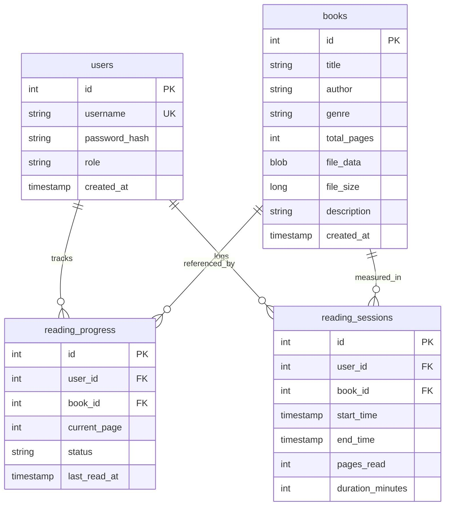
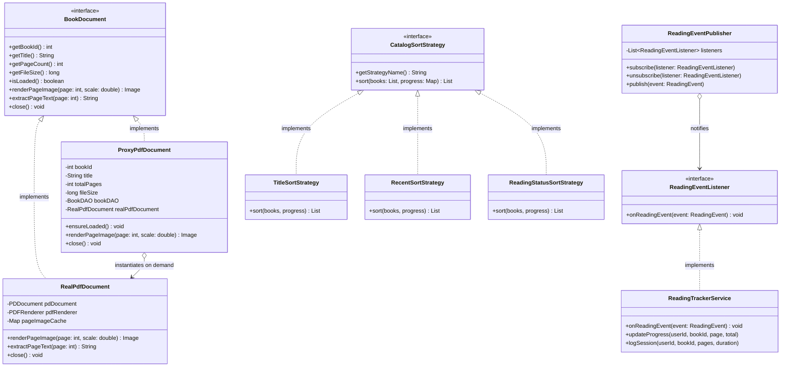

# BookHaven Architecture & UML / ER Specifications

This document contains visual diagrams and architecture models for the **BookHaven** application.

---

## 1. Database Entity-Relationship (ER) Diagram

---

## 2. Core Class & Design Pattern Diagram

